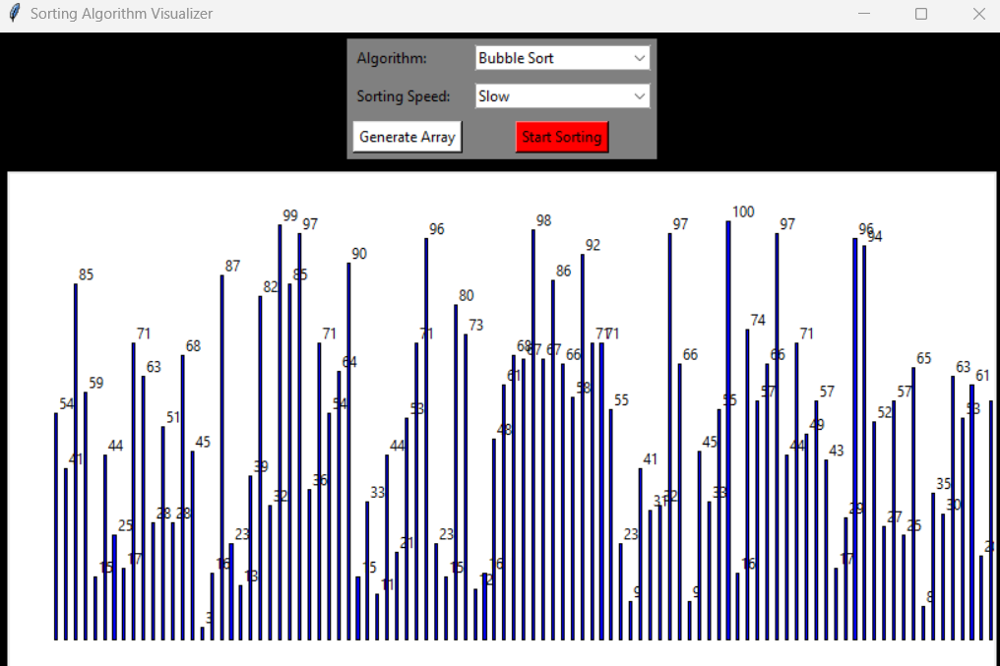

# Sorting Algorithm Visualizer

This Python GUI application provides a visual demonstration of various sorting algorithms. It allows users to generate random arrays and visualize how different sorting algorithms rearrange the elements to sort the array.

## Features

- Graphical User Interface (GUI) using tkinter.
- Real-time visualization of sorting algorithms.
- Supports multiple sorting algorithms:
  - Bubble Sort
  - Merge Sort
  - Quick Sort
  - Selection Sort
  - Insertion Sort
  - Heap Sort
- Adjustable sorting speed.
- Generates random arrays for sorting.

## Requirements

- Python 3.x
- tkinter
- matplotlib
- numpy

## Installation

1. Clone the repository:

    ```bash
    https://github.com/ankitkumar131/sorting-algorithm-visualize.git
    ```

2. Navigate to the project directory:

    ```bash
    cd sorting-algorithm-visualizer
    ```

3. Install the required Python packages:

    ```bash
    pip install -r requirements.txt
    ```

## Usage

1. Run the application:

    ```bash
    python main.py
    ```

## Screenshots




## Video

goto assets/video folder to see


2. Choose a sorting algorithm from the dropdown menu.
3. Adjust the sorting speed if necessary.
4. Click on "Generate Array" to create a random array.
5. Click on "Start Sorting" to visualize the chosen sorting algorithm in action.


## Contributing

Contributions are welcome! Please follow these steps:

1. Fork the repository.
2. Create your feature branch (`git checkout -b feature/your-feature`).
3. Commit your changes (`git commit -am 'Add some feature'`).
4. Push to the branch (`git push origin feature/your-feature`).
5. Create a new Pull Request.

## License

[Choose an open-source license and add it here. For example: MIT License]

